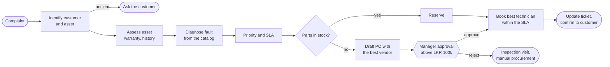
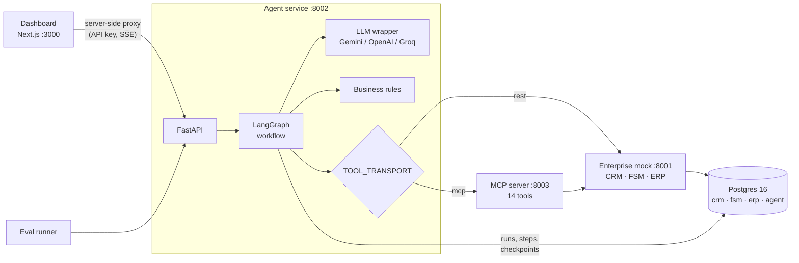

# FieldOps Agent

An AI agent that does a field service coordinator's job end to end. It reads a supermarket's freezer
complaint, identifies the exact asset, diagnoses the fault, reserves or orders parts, waits for a manager
when a purchase order is large, books the right technician within the SLA, and confirms with the customer.
It works across mock CRM, FSM and ERP systems, over REST or the Model Context Protocol.

<!-- Demo GIF placeholder: record the dashboard flow below (submit, live steps, approve, KPIs) and save it as docs/demo.gif -->
> **Demo GIF placeholder:** `docs/demo.gif` will show a complaint submitted in the dashboard, the agent's
> steps streaming live, a manager approving the purchase order, and the KPI cards updating.

**Highlights**

- **The LLM reads and writes; Python decides.** Gemini extracts facts, picks a fault code from the
  catalog and words messages. Every priority, SLA, vendor choice, approval, technician ranking, date and
  amount of money comes from pure, unit-tested rules configured in [`config/rules.yaml`](config/rules.yaml).
- **Validated LLM output.** Each output is checked against a Pydantic schema. A failed check gets one
  retry with the errors, then the run goes to a human. No business rules appear in the prompts.
- **Durable human in the loop.** A purchase order above LKR 100,000 pauses the run with LangGraph
  `interrupt()`. The state is checkpointed in Postgres, so a paused run survives a restart and resumes
  on approve or reject.
- **Observable.** Every node, tool call and LLM call is logged with its input, output, latency and tokens,
  streamed live over Server-Sent Events, and shown in a Next.js dashboard with KPIs.
- **Measured.** 30 end-to-end eval scenarios run against a real LLM on both transports. CI runs 202 tests,
  linting and the dashboard build on every push.
- **Two transports, one tool set.** `TOOL_TRANSPORT=rest|mcp` switches between calling the mock APIs
  directly and calling the same 14 tools on an MCP server built with the official Python SDK.
- **Resilient by design.** Idempotent calls retry with backoff; a POST is never blindly retried.
  `CHAOS_MODE` injects failures to show it.

## The process



The full process with every decision point is in [docs/process-map.md](docs/process-map.md). How each
step maps to a graph node, tool and rule is in [docs/agent-design.md](docs/agent-design.md).

## Architecture



| Service | Stack | Role |
| --- | --- | --- |
| `enterprise_mock` | FastAPI, SQLAlchemy 2, Alembic | CoolTech's CRM, FSM and ERP, with typed APIs, deterministic seed data and optional chaos |
| `agent` | LangGraph, FastAPI, httpx, Pydantic v2 | The workflow, rules, tools, LLM wrapper, run log, approvals, SSE and KPIs |
| `mcp_server` | Official MCP Python SDK (Streamable HTTP) | The agent's tool set for any MCP client |
| `web` | Next.js 16, TypeScript, Tailwind, TanStack Query | New ticket, live run view, approvals inbox, runs and KPIs |
| `evals` | Python | 30 scenarios against the live stack |

## Latest eval results

30 scenarios across the spec's 8 groups:

- parts in stock
- PO under the approval threshold
- PO over the threshold, with approve and reject
- ambiguous asset
- low-confidence diagnosis
- warranty claim
- no technician within the SLA
- unknown sender

Each scenario passes only if **every** expected field matches. The LLM was `gemini-3.5-flash-lite`.

| Transport | Overall pass rate | Field accuracy | Tool-call errors | Avg latency | Avg tokens |
| --- | --- | --- | --- | --- | --- |
| REST | **96.7%** (29/30) | 97.8% | 1 of 467 (expected: the unknown sender) | 4.6 s | 1,892 |
| MCP | **100%** (30/30) | 100% | 1 of 467 (expected: the unknown sender) | 3.8 s | 1,895 |
| REST + chaos mode (10% 503s, ≤ 800 ms latency) | 63.3% (19/30) | 77.3% | 12 (11 injected) | 9.3 s | 1,641 |

The one REST failure is honest: *"Loud clicking from the compressor, it won't start"* was diagnosed as
a start relay rather than a compressor failure. The catalog lists both symptoms under both faults, and
everything downstream followed correctly from that diagnosis.

**Chaos mode** (a resilience test, not a pass/fail target) worked as designed. It injected 43 failures (503s):

- **Absorbed:** all 32 on GET or PATCH calls were retried away with no effect on the runs.
- **Stopped safely:** each of the 11 on a POST (create ticket, message, PO, work order) ended that run at
  `needs_human`. The agent never retried a request that might already have succeeded, so nothing was
  duplicated.

Idempotency keys on the POST endpoints would let those runs recover too (see Limitations).

Full reports:
[REST](evals/results/latest-rest.md) · [MCP](evals/results/latest-mcp.md) ·
[chaos](evals/results/latest-rest-chaos.md).

## Run it

Prerequisite: Docker with Compose v2. You don't need Python or Node on the host.

```bash
cp .env.example .env              # set GEMINI_API_KEY (or LLM_PROVIDER=openai|groq and its key)
docker compose up -d --build --wait
```

| What | Where |
| --- | --- |
| Dashboard | <http://localhost:3000> |
| Agent API docs | <http://localhost:8002/docs> (`X-API-Key: dev-agent-key`) |
| Mock enterprise API docs | <http://localhost:8001/docs> (`X-API-Key: dev-mock-key`) |
| MCP server | <http://localhost:8003/mcp> (`X-API-Key: dev-mcp-key`) |

Only agent runs need an LLM key. On first start, the mock migrates and seeds its database.

### Demo in the browser

1. **New ticket:** click **Reset demo data**. Keep **Demo clock** on, which runs as if it is 09:00
   today, or Monday if today is Sunday.
2. Pick **FreshMart demo** and click **Start run**. Watch the steps stream in, and click any tool or LLM
   call to see its input and output. Outcome: TECH-02 booked at 10:00, compressor reserved, priority P1,
   warranty and repeat-failure notes on the ticket.
3. Pick **Big PO: needs approval** and start it. The run pauses, and **Approvals** shows a badge. The
   inbox explains the vendor choice and the diagnosis.
4. Approve or reject, either in the inbox or on the run page. The run resumes live.
5. **Runs** shows every run, with KPI cards: auto-resolved rate, average time to schedule, approval
   rate and average tokens per run.

### Demo in the terminal

```bash
D=2026-10-03   # today's date (not a Sunday)
docker compose exec enterprise_mock python -m app.seed --reset --today $D
docker compose exec agent python -m app.cli "Freezer #3 at our Colombo 7 branch stopped cooling again this morning." --email ops@freshmart.lk --now ${D}T09:00
```

The CLI prints each step as it happens and ends with the summary (`scheduled`, `FRZ-1043`, `P1`,
`TECH-02` at 10:00). A run that pauses for approval prints its resume command:

```bash
docker compose exec agent python -m app.cli --resume <run_id> --decision approve --comment "OK"
```

A paused run survives `docker compose restart agent`.

### Run the evals

```bash
docker compose --profile evals run --rm evals --delay 10                         # REST (default)
TOOL_TRANSPORT=mcp docker compose --profile evals run --rm evals --delay 10      # through the MCP server
CHAOS_MODE=true CHAOS_SEED=7 docker compose --profile evals run --rm evals --delay 10
docker compose --profile evals run --rm evals --only demo-freshmart              # one scenario
```

Put `TOOL_TRANSPORT` or `CHAOS_MODE` in front of the eval command itself. `compose run` re-applies the
config to the agent and mock, so a setting given only to an earlier `up` is lost. Each report records the
transport and chaos settings it actually ran with, and each setup keeps its own
`evals/results/latest-<label>.md`. `--min-pass-rate 0.85` sets the exit code. `--delay` spaces out calls
for free-tier rate limits.

### Use the MCP server from any MCP client

```bash
npx @modelcontextprotocol/inspector
# Streamable HTTP · http://localhost:8003/mcp · header X-API-Key: dev-mcp-key
```

The 14 tools are `find_customer`, `find_asset`, `get_asset_summary`, `list_fault_codes`,
`check_part_stock`, `reserve_part`, `find_vendors`, `create_purchase_order`, `update_purchase_order`,
`find_available_technicians`, `create_work_order`, `create_ticket`, `update_ticket` and
`send_customer_message`. See [services/mcp_server](services/mcp_server/README.md).

### Configuration

| Setting | Where | Effect |
| --- | --- | --- |
| Business-rule thresholds | `config/rules.yaml` | SLA hours, approval threshold, repeat window, confidence threshold, inspection hours (no rebuild needed) |
| `LLM_PROVIDER`, `LLM_MODEL`, `*_API_KEY` | `.env` | `gemini` (default), `openai` or `groq` |
| `TOOL_TRANSPORT` | `.env` | `rest` (default) or `mcp` |
| `CHAOS_MODE`, `CHAOS_ERROR_RATE`, `CHAOS_MAX_LATENCY_MS`, `CHAOS_SEED` | `.env` | Random 503s and latency on CRM/FSM/ERP calls |
| `AGENT_NOW`, `SEED_TODAY` | `.env` | Pin the agent's clock or the seed date |

## Tests and CI

```bash
docker compose run --rm enterprise_mock pytest
docker compose run --rm agent pytest
docker compose --profile evals run --rm --no-deps --entrypoint pytest evals test_run_evals.py
(cd web && npm ci && npm run lint && npm run typecheck && npm run build)
```

None of the tests need an LLM key or touch your dev data:

- **Mock:** endpoints, seed determinism, admin reseed and chaos mode.
- **Agent:**
  - business rules
  - tools against a fake API, with retry policy and error mapping
  - the LLM wrapper against fake provider endpoints
  - the graph with a scripted LLM, including approval pause and resume
  - a paused run resumed by a brand-new checkpointer (the restart case)
  - the API and SSE stream
  - MCP: the server, the client, the whole graph over MCP, and real Streamable HTTP with the API key

[`.github/workflows/ci.yml`](.github/workflows/ci.yml) runs on every push:

- ruff
- the mock, agent and eval-runner test suites (Python 3.12 against a Postgres service container)
- the dashboard's lint, type-check and build

A manual run starts the whole stack and runs the 30 evals with the `GEMINI_API_KEY` secret, on the
transport you choose.

## Repository

```text
config/rules.yaml              business-rule thresholds
services/enterprise_mock/      mock CRM, FSM, ERP (FastAPI, Alembic, seed, chaos)
services/agent/app/
  graph.py  nodes/  state.py   LangGraph workflow and the Agent runner
  rules.py                     pure business rules
  tools.py  mcp_tools.py       enterprise tools over REST, and the same tools over MCP
  mcp_server.py                the tools as an MCP server (packaged by services/mcp_server)
  llm.py  prompts/             provider-agnostic LLM wrapper, Markdown prompts
  api.py  cli.py               agent API (runs, approvals, SSE, metrics) and CLI
  store.py  recorder.py  checkpoint.py  run log and Postgres checkpointer
services/mcp_server/           Dockerfile and docs for the MCP server
evals/                         30 scenarios, runner, reports
web/                           Next.js dashboard
docs/                          process map and agent design
```

## Seed data

The seed is deterministic: the same reference date always gives the same data.

- **Customers:** 20, across Colombo, Kandy, Galle and Kurunegala, on gold, silver or bronze contracts.
- **Assets:** 50, across 5 freezer and chiller models.
- **Service history:** 120 records, including repeat failures.
- **Catalog:** 12 fault codes, 30 parts (several out of stock) and 6 vendors (4 approved).
- **Technicians:** 8, with two weeks of 2-hour slots.
- **The demo case:** FreshMart's Freezer #3 (`FRZ-1043`) is under warranty, and TECH-02 replaced its
  compressor 60 days earlier.

Money is in whole LKR, and every time is Asia/Colombo.

## Limitations

- **The evals share code with the agent.** Their expected values were worked out with the agent's own rule
  functions, so they test the LLM, graph, tools and API working together. The rules have their own unit
  tests.
- **Diagnosis needs a clear description.** Vague complaints become inspection visits by design. Borderline
  wording can flip between related faults, as in the one eval failure above.
- **POSTs are not retried.** A failed POST hands the run to a human rather than risking a duplicate.
  Idempotency keys on the enterprise APIs would make those calls safe to retry, and are the obvious next
  step.
- **Out of scope, per the spec:** real authentication beyond API keys, real email and SMS (messages are
  logged to the CRM), payments and multi-tenancy.
