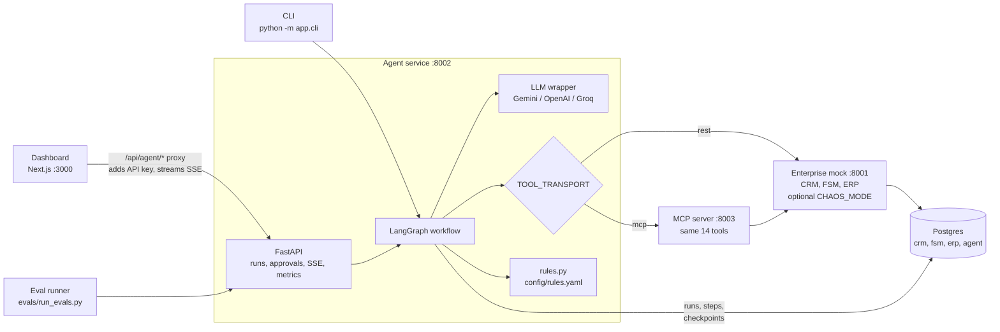
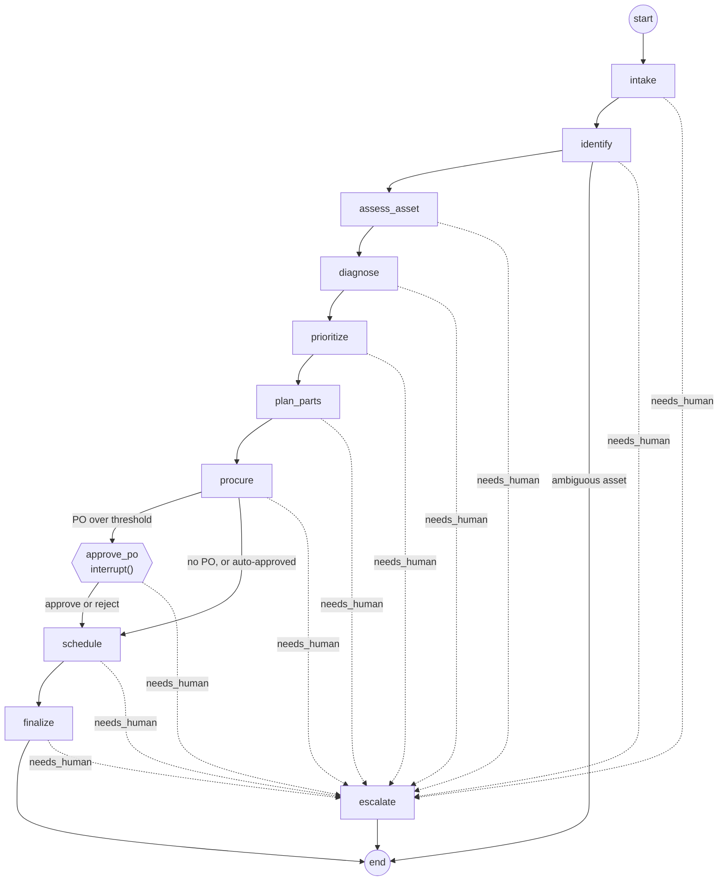
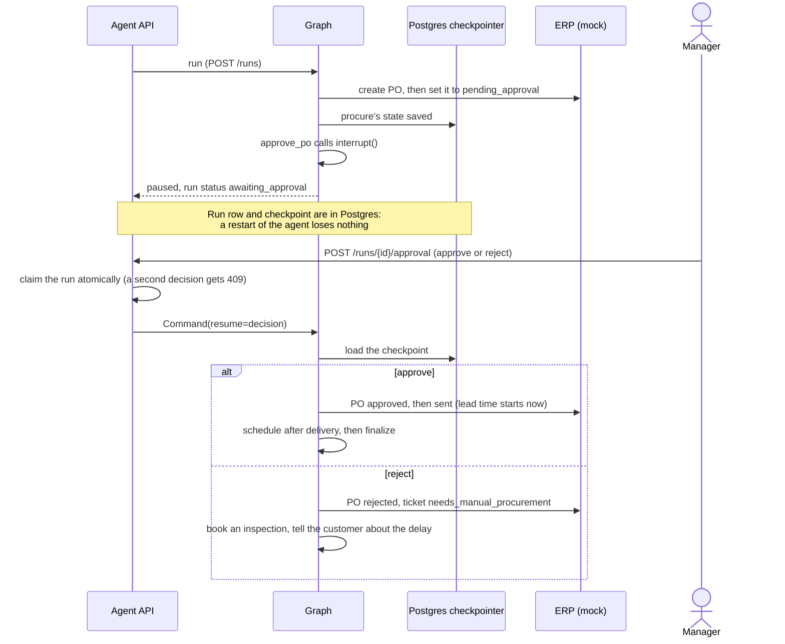

# Agent design

How the [business process](process-map.md) becomes software: the LangGraph workflow, the tools, the business
rules, and the line between what the LLM decides and what plain Python decides.

## Principle: the LLM reads and writes; Python decides

| The LLM does | Python does (deterministic, unit-tested) |
| --- | --- |
| Extract facts from the complaint (asset name, site, symptoms, "is it down?") | Match the customer and the asset |
| Pick a fault code **from the catalog it is shown** and rate its confidence | Derive parts and skill from the catalog; apply the confidence threshold |
| Word one clarifying question | Priority, SLA deadline, warranty and repeat-failure facts |
| Word the customer confirmation from given facts | Vendor choice, PO totals, approval threshold, technician ranking, every date |

Every LLM output is validated against a Pydantic schema. A fault code outside the catalog, or a message that
leaves out the technician's name or visit time, is rejected. The model gets one retry with the validation
errors; a second failure sends the run to human review. No business rule appears in any prompt, and a test
checks for this (`test_prompts_never_see_business_rules`).

## Architecture

## The graph

After every node, the run's status picks the route:

- `running` continues to the next node.
- `needs_human` goes to `escalate`, which notes the reason on the ticket.
- `awaiting_approval` (only after `procure`) goes to `approve_po`.
- `needs_info` and the final statuses end the run.

## Process step → node → tools → rules

| Process step | Node | Tools | Rules (`rules.py`) | LLM |
| --- | --- | --- | --- | --- |
| Identify the sender, open the ticket | `intake` | `find_customer`, `create_ticket` | — | Extract asset name, site, symptoms, asset down |
| Match the asset, or ask which one | `identify` | `find_asset`, `send_customer_message`, `update_ticket` | — (site-hint match is plain Python) | Word the clarifying question |
| Warranty, age, history | `assess_asset` | `get_asset_summary`, `update_ticket` | `compute_asset_facts` | — |
| Diagnose | `diagnose` | `list_fault_codes`, `check_part_stock` | `needs_inspection` | Pick a fault code from the catalog, with confidence |
| Priority and SLA | `prioritize` | `update_ticket` | `priority`, `sla_deadline`, `ticket_notes` | — |
| Reserve parts in stock | `plan_parts` | `check_part_stock`, `reserve_part` | `plan_parts` | — |
| Order the rest | `procure` | `find_vendors`, `create_purchase_order`, `update_purchase_order`, `update_ticket` | `choose_vendor`, `po_requires_approval` | — |
| Manager approval | `approve_po` | `update_purchase_order`, `update_ticket` | `parts_ready_at` | — |
| Book the technician | `schedule` | `find_available_technicians`, `create_work_order` | `choose_technician` | — |
| Confirm and close out | `finalize` | `send_customer_message`, `update_ticket` | — | Word the confirmation from given facts |
| Hand over | `escalate` | `update_ticket` | — | — |

## Human in the loop

`procure` and `approve_po` are separate nodes on purpose. LangGraph re-runs an interrupted node from the top
when it resumes. So every side effect (creating the PO) happens in `procure` before the pause, and
`approve_po` contains only the `interrupt()` and the work that follows the decision. A test checks that
resuming never creates a second PO.

## Tools and transports

Each tool is a typed function returning `ToolResult {ok, data, error}`. It never raises for API or network
failures, so a node can decide what a failure means.

| Situation | Retried? | Why |
| --- | --- | --- |
| GET or PATCH: timeout, connection error, 5xx, 429 | Up to 2 times, with backoff | Idempotent |
| POST that could not connect | Up to 2 times | The request never reached the server |
| POST that timed out or got a 5xx | No | It may have succeeded; a retry could reserve stock twice or create a duplicate PO |
| Any 4xx | No | Retrying cannot help |

`TOOL_TRANSPORT` chooses how the same tool calls reach the enterprise systems:

- **`rest`** (default): `EnterpriseTools` calls the mock's REST API directly.
- **`mcp`**: `McpTools` calls the same 14 tools on the MCP server (Streamable HTTP, official MCP Python SDK).
  The MCP server wraps the same `EnterpriseTools`, so there is one implementation, and the client turns the
  JSON back into the same typed models. Nodes, rules and logging cannot tell the transports apart; the evals
  run on both.

`get_asset_summary` takes an `as_of` date, so warranty and repeat-failure facts use the run's business date
rather than the MCP server's clock.

**Chaos mode** (`CHAOS_MODE=true` on the mock) adds random latency and 503s to CRM, FSM and ERP calls, to
show the retry policy at work. GETs recover; a failed POST sends the run to human review instead of
risking a duplicate.

## Observability

Every node, tool call and LLM call becomes one row in `agent.run_steps`, with its input, output, latency,
tokens and error. Runs, with their summary and final state, are in `agent.runs`. The same rows feed:

- the CLI's live trace
- `GET /runs/{id}/events` (Server-Sent Events, resumable with `Last-Event-ID`) and the dashboard timeline
- `GET /metrics` (the dashboard KPIs)
- the eval reports (tool errors, latency, tokens)

## Evals

There are 30 scenarios in `evals/scenarios/`, in the spec's 8 groups. Each one reseeds the mock systems for a
fixed date, pins the agent's clock, answers any approval pause, and compares up to ten fields with the run
summary. The expected values come from the seed data and the rules, and each one was checked by hand. The
overall pass rate is strict: a scenario passes only if every field matches. Reports are in
`evals/results/`, one per transport.

## Known limitations

- The expected eval values were worked out with the same rule functions the agent uses. So the evals test
  the LLM, graph, tools and API working together, and the rules themselves are covered by their own unit
  tests.
- Diagnosis depends on how clearly the customer describes the fault. Vague complaints (correctly) become
  inspection visits, so they never order parts on a guess.
- A decision made through the dashboard is stamped with the real time, so delivery dates count from when the
  manager clicked. The evals pin the decision time instead.
- Single-tenant, API-key auth, and emails and SMS logged to the CRM rather than sent, as the spec scopes it.
