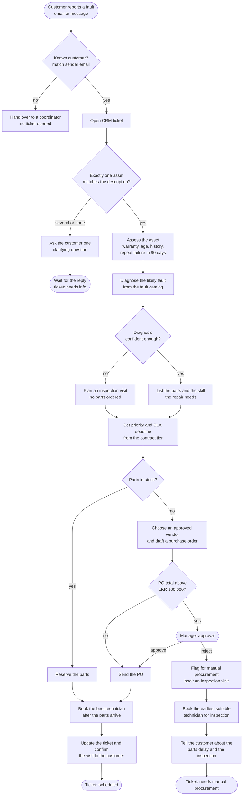
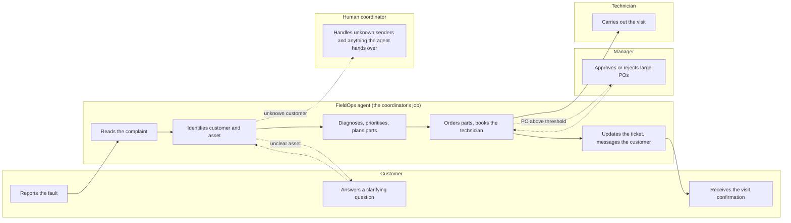

# Process map: CoolTech field service

CoolTech Services repairs commercial freezers and chillers for supermarkets across Sri Lanka. This is the
coordinator's process that the FieldOps agent runs, from a customer complaint to a booked technician.
How each step maps to code is in [agent-design.md](agent-design.md).

## End-to-end flow

## Who does what

## Business rules

All of them live in `services/agent/app/rules.py`, and the thresholds are in `config/rules.yaml`.

| Rule | Logic |
| --- | --- |
| SLA by contract tier | Technician on site within: gold 4 h, silver 24 h, bronze 72 h |
| Priority | Gold with the asset down = P1; other gold and silver = P2; bronze = P3; a repeat failure within 90 days raises it one level |
| Warranty | If the asset is under warranty, the PO is a warranty claim and the ticket says so |
| Repeat failure | A repair within the last 90 days adds a supervisor-review note to the ticket |
| Vendor choice | Approved vendors only; the cheapest that delivers before the SLA deadline; if none can, the fastest, flagged as an SLA risk |
| PO approval | Above LKR 100,000 needs a manager; at or below is approved automatically |
| Technician choice | Required skill and the asset's region; among visits within the SLA, prefer whoever worked on this asset most recently, then the earliest slot, then the fewest jobs that day; if nobody fits the SLA, take the earliest slot and flag the risk |
| Low-confidence diagnosis | Confidence below 0.6 books an inspection visit and orders no parts |

## Outcomes

| Ticket status | Meaning |
| --- | --- |
| `scheduled` | Technician booked; parts reserved or ordered; customer told the visit time |
| `needs_info` | Waiting for the customer to say which unit |
| `awaiting_approval` | A large PO is waiting for a manager; nothing is booked yet |
| `needs_manual_procurement` | The manager rejected the PO; an inspection is booked and the customer told about the delay |
| `needs_human` | Unknown sender, or something the agent could not resolve; the reason is on the ticket |
